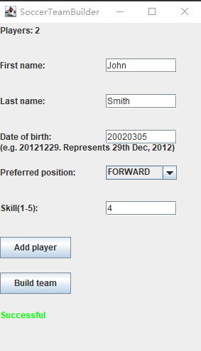
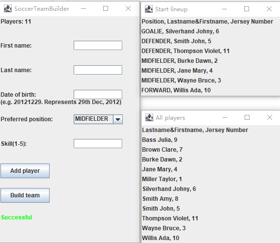

Author: Xiangyuan DING

A program written to build a soccer team for children over 10 years old. 
The maximum capacity of the team is 20 person, and the minimum is 10 person. 
7 of the players will be chosen to play, others will be on the bench. 
The chosen players are selected by skill levels, and their positions are determined with their will.

run src/soccerteam/Driver to start

  

